<div align="center">

# 🚀 Incident Report - Real-Time Incident Management Platform

**A comprehensive, real-time incident reporting and management platform for law enforcement agencies, emergency response teams, and community safety initiatives**

[](https://www.typescriptlang.org/)
[](https://reactjs.org/)
[](https://nodejs.org/)
[](https://www.mongodb.com/)
[](https://socket.io/)

[](https://incidence-report.netlify.app/)

[Features](#-features) • [Tech Stack](#-tech-stack) • [Quick Start](#-quick-start) • [Live Demo](#-live-demo) • [Documentation](#-documentation) • [Contributing](#-contributing)

</div>

---

## 🌟 Overview

**Incident Report** is a comprehensive, real-time incident reporting and management platform designed specifically for law enforcement agencies, emergency response teams, and community safety initiatives. Built with modern web technologies, it streamlines the entire incident lifecycle from initial report to resolution.

### 💡 Why Incident Report?

- ⚡ **Real-time Communication** - Instant chat between citizens and law enforcement
- 🔒 **Secure & Anonymous** - Report incidents with or without identification
- 📱 **Mobile-First Design** - Works seamlessly on any device
- 🎯 **Role-Based Access** - Specialized interfaces for different user types
- 📊 **Analytics Dashboard** - Track response times and crime patterns
- 🌐 **Multi-Department Support** - Coordinate across specialized units

### 🎯 Problem Statement

Traditional incident reporting systems are often:

- ❌ Slow and bureaucratic
- ❌ Lack real-time communication
- ❌ Don't support anonymous reporting
- ❌ Have poor mobile experiences
- ❌ Provide limited tracking for citizens

**Incident Report** solves these problems with a modern, user-friendly platform that prioritizes speed, security, and transparency.

### ✨ What Makes This Special?

**Incident Report** is a **production-ready, enterprise-grade solution** that combines real-time communication, intelligent case routing, and comprehensive analytics into one seamless experience. Whether you're handling customer support, incident reports, or emergency response, this platform scales with your needs.

- ⚡ **Lightning-Fast Real-Time Communication** - Built on Socket.io for instant messaging
- 🎯 **Smart Case Routing** - AI-ready architecture for intelligent agent assignment
- 📊 **Rich Analytics Dashboard** - Beautiful visualizations with Recharts
- 🔐 **Enterprise Security** - JWT authentication, role-based access control
- 🎨 **Modern UI/UX** - Built with Tailwind CSS, Radix UI, and Framer Motion
- 📱 **Fully Responsive** - Works flawlessly on desktop, tablet, and mobile
- 🚀 **Production Ready** - Comprehensive error handling, validation, and testing
- 📚 **Fully Documented** - Swagger API documentation included

---

## ✨ Key Features

### 👥 For Citizens/Customers

- 📝 **Easy Reporting** - Submit incidents in under 2 minutes
- 🔐 **Secure Account Creation** - Email OTP verification for account registration
- 🔑 **Password Recovery** - Secure password reset via email OTP verification
- 🕵️ **Anonymous Options** - Report without revealing identity
- 💬 **Direct Communication** - Chat with assigned officers in real-time
- 📍 **Location Tracking** - Automatic GPS location capture
- 📎 **Evidence Upload** - Attach photos, videos, and documents
- 🔔 **Status Notifications** - Get updates on your case progress
- 📱 **Mobile App** - iOS and Android support (coming soon)

### 👮 For Law Enforcement Agents

- 🎯 **Smart Assignment** - Auto-routing to specialized departments
- 📊 **Case Dashboard** - Manage all assigned incidents
- 💬 **Multi-Channel Communication** - Chat, voice notes, file sharing
- 🔍 **Investigation Tools** - Timeline tracking, evidence management
- 🤝 **Collaboration** - Work with other departments seamlessly
- 📈 **Performance Metrics** - Track response times and resolution rates
- 🔔 **Real-time Alerts** - Instant notifications for urgent cases

### 👔 For Supervisors & Admins

- 📊 **Analytics Dashboard** - Comprehensive reporting and insights
- 👥 **Agent Management** - Create, assign, and monitor agents
- 🏢 **Department Oversight** - Track workload distribution
- 🎚️ **Priority Management** - Escalate critical incidents
- 📈 **Trend Analysis** - Identify crime patterns and hotspots
- ⚙️ **System Configuration** - Customize workflows and settings
- 📋 **Audit Logs** - Complete activity tracking

---

## 🎯 Technical Features

### 💬 Real-Time Communication
- **Live Chat System** - Instant messaging between customers and agents
- **Typing Indicators** - See when someone is typing in real-time
- **Read Receipts** - Track message delivery and read status
- **Emoji Support** - Rich emoji picker for expressive communication
- **File Attachments** - Upload and share images via Cloudinary

### 📋 Case Management
- **Multi-Status Workflow** - Pending → Active → Resolved/Rejected
- **Department-Based Routing** - 20+ specialized departments
- **Location Tracking** - GPS-based location services
- **Case History** - Complete audit trail of all interactions
- **Priority Assignment** - Smart prioritization system

### 👥 Role-Based Access Control
- **Customer Portal** - Submit cases, track status, chat with agents
- **Agent Dashboard** - Manage assigned cases, real-time chat, analytics
- **Supervisor View** - Oversee team performance and case distribution
- **Admin Panel** - Full system control, user management, analytics

### 📊 Analytics & Insights
- **Real-Time Dashboards** - Live metrics and KPIs
- **Performance Tracking** - Response times, resolution rates
- **Team Analytics** - Agent performance metrics
- **Case Statistics** - Department-wise breakdowns
- **Visual Charts** - Beautiful data visualizations

### 🔔 Notifications
- **Real-Time Alerts** - Instant notifications for new messages and case updates
- **Email Notifications** - Automated email alerts via Nodemailer/Resend
- **In-App Notifications** - Persistent notification center
- **Status Updates** - Automatic notifications on case status changes

### 🛡️ Security & Authentication
- **JWT Authentication** - Secure token-based authentication
- **OTP Verification** - Email-based OTP for account creation and password reset
- **Password Hashing** - Bcrypt with salt rounds
- **Cookie-Based Sessions** - Secure HTTP-only cookies
- **Role-Based Permissions** - Granular access control
- **Input Validation** - Yup schema validation

---

## 🛠️ Tech Stack

### Frontend (`client/`)
| Technology | Purpose | Version |
|------------|---------|---------|
| **React 18** | UI Framework | Latest |
| **TypeScript** | Type Safety | Latest |
| **Vite** | Build Tool | Latest |
| **Tailwind CSS** | Styling | Latest |
| **Radix UI** | Accessible Components | Latest |
| **Framer Motion** | Animations | Latest |
| **React Query** | Data Fetching | v5 |
| **Zustand** | State Management | v5 |
| **Socket.io Client** | Real-Time Communication | v4 |
| **React Router** | Routing | v6 |
| **React Hook Form** | Form Management | Latest |
| **Yup** | Validation | Latest |
| **Recharts** | Data Visualization | Latest |
| **Sonner** | Toast Notifications | Latest |

### Backend (`backend/`)
| Technology | Purpose | Version |
|------------|---------|---------|
| **Node.js** | Runtime | Latest |
| **Express.js** | Web Framework | v4 |
| **MongoDB** | Database | Latest |
| **Mongoose** | ODM | v8 |
| **Socket.io** | WebSocket Server | v4 |
| **JWT** | Authentication | v9 |
| **Bcrypt** | Password Hashing | Latest |
| **Multer** | File Upload | Latest |
| **Cloudinary** | Media Storage | Latest |
| **Nodemailer/Resend** | Email Service | Latest |
| **Swagger** | API Documentation | Latest |

---

## 🚀 Quick Start

### Prerequisites

- **Node.js** >= 18.x
- **MongoDB** >= 6.x (local or Atlas)
- **npm** or **yarn**

### Installation

1. **Clone the repository**
   ```bash
   git clone https://github.com/khalifadalhat/IncidentReport.git
   cd IncidentReport
   ```

2. **Install dependencies**
   ```bash
   # Install root dependencies (if any)
   npm install

   # Install backend dependencies
   cd backend
   npm install

   # Install frontend dependencies
   cd ../client
   npm install
   ```

3. **Environment Setup**

   **Backend** (`backend/.env`):
   ```env
   # Database
   MONGODB_URI=mongodb://localhost:27017/incidentreport
   
   # JWT
   JWT_SECRET=your-super-secret-jwt-key-change-this-in-production
   
   # Server
   PORT=5000
   NODE_ENV=development
   
   # CORS
   ALLOWED_ORIGINS=http://localhost:5173,http://localhost:3000
   
   # Cloudinary (for file uploads)
   CLOUDINARY_CLOUD_NAME=your-cloud-name
   CLOUDINARY_API_KEY=your-api-key
   CLOUDINARY_API_SECRET=your-api-secret
   
   # Email (required for OTP functionality)
   GMAIL_USER=your-email@gmail.com
   GMAIL_APP_PASSWORD=your-gmail-app-password
   # Alternative email service (optional)
   EMAIL_HOST=smtp.gmail.com
   EMAIL_PORT=587
   EMAIL_USER=your-email@gmail.com
   EMAIL_PASS=your-app-password
   RESEND_API_KEY=your-resend-key
   ```

   **Frontend** (`client/.env`):
   ```env
   VITE_API_URL=http://localhost:5000
   ```

4. **Create Admin User** (Optional)
   ```bash
   cd backend
   node createAdmin.js
   ```

5. **Start Development Servers**

   **Terminal 1 - Backend:**
   ```bash
   cd backend
   npm start
   ```
   Backend runs on `http://localhost:5000`
   API Docs available at `http://localhost:5000/api-docs`

   **Terminal 2 - Frontend:**
   ```bash
   cd client
   npm run dev
   ```
   Frontend runs on `http://localhost:5173`

6. **Access the Application**
   - Frontend: http://localhost:5173
   - Backend API: http://localhost:5000
   - API Documentation: http://localhost:5000/api-docs

---

## 📁 Project Structure

```
incidentreport/
├── client/                 # React + TypeScript Frontend
│   ├── src/
│   │   ├── components/    # Reusable UI components
│   │   │   ├── agent/     # Agent-specific components
│   │   │   ├── auth/      # Authentication components
│   │   │   ├── ui/        # Base UI components (Radix UI)
│   │   │   └── ...
│   │   ├── pages/         # Page components
│   │   │   ├── admin/     # Admin dashboard pages
│   │   │   ├── agent/     # Agent dashboard pages
│   │   │   ├── customer/  # Customer portal pages
│   │   │   └── supervisor/# Supervisor pages
│   │   ├── hooks/         # Custom React hooks
│   │   ├── store/         # Zustand state management
│   │   ├── routes/        # React Router configuration
│   │   ├── utils/         # Utility functions
│   │   └── ...
│   ├── public/            # Static assets
│   └── package.json
│
├── backend/               # Node.js + Express Backend
│   ├── config/           # Configuration files
│   │   ├── db.js         # MongoDB connection
│   │   └── cloudinary.js # Cloudinary setup
│   ├── controllers/      # Route controllers
│   ├── models/           # Mongoose models
│   ├── routes/           # Express routes
│   ├── middleware/       # Custom middleware
│   ├── utils/            # Utility functions
│   ├── server.js         # Entry point
│   └── swagger.js        # API documentation
│
└── README.md
```

---

## 📚 API Documentation

The backend includes comprehensive **Swagger/OpenAPI documentation**. Once the server is running, visit:

```
http://localhost:5000/api-docs
```

### Key Endpoints

#### Authentication
User login/register (Customer/Agent/Admin)

- `POST /api/auth/login` - Login user (Customer/Agent/Admin)
- `POST /api/auth/admin/create` - Register new Admin

**Account Registration with OTP:**
- `POST /api/auth/register/request-otp` - Request OTP for account registration (sends 6-digit OTP to email)
- `POST /api/auth/register/verify-otp` - Verify OTP for registration (validates email and OTP)
- `POST /api/auth/register` - Complete customer registration (after OTP verification)

**Password Reset with OTP:**
- `POST /api/auth/forgot-password` - Request password reset OTP (sends 6-digit OTP to email)
- `POST /api/auth/forgot-password/verify-otp` - Verify password reset OTP (validates email and OTP)
- `POST /api/auth/reset-password` - Reset password (after OTP verification)

**Password Change (Authenticated):**
- `POST /api/auth/change-password/request-otp` - Request OTP for password change (requires authentication)
- `POST /api/auth/change-password` - Change password with OTP (requires authentication)

#### Cases
Support cases/tickets management

- `POST /api/cases` - Create new case (Customer only)
- `GET /api/cases` - Get all cases (Admin only)
- `GET /api/cases/my` - Get my cases (Customer/Agent)
- `PATCH /api/cases/{caseId}/accept` - Accept case (Agent only)
- `PATCH /api/cases/{caseId}/status` - Update case status (Agent only)
- `PATCH /api/cases/assign` - Assign case to agent (Admin only)

#### Chat
Chat history & unread counts

- `GET /api/chat/history` - Get chat history (Customer/Agent)
- `GET /api/chat/case/{caseId}` - Get case chat (Customer/Agent)
- **Note:** Real-time messaging is handled via Socket.io (preferred method)

#### Messages
HTTP fallback for messages (real-time via Socket.IO)

- `GET /api/messages/case/{caseId}` - Get messages for case (fallback)

#### Users
Profile management & agent creation (Admin/Supervisor only)

- `GET /api/users/profile` - Get current user profile
- `PATCH /api/users/profile` - Update user profile
- `POST /api/users/agents` - Create new agent (Admin/Supervisor only)
- `GET /api/users/agents` - Get all agents (Admin/Supervisor only)

#### Admin
Admin-only endpoints

- `GET /api/admin/dashboard` - Get admin dashboard stats
- `GET /api/admin/users` - Get all users (Admin only)
- `GET /api/admin/cases` - Get all cases (Admin only)
- `DELETE /api/admin/users/{userId}` - Delete user (Admin only)

> **Note:** Additional admin endpoints like `/api/admin/performance` may be available but are not documented in the Swagger API.

#### Notifications
User-specific notifications and status updates

- `GET /api/notifications` - Get a list of the user's notifications
- `GET /api/notifications/unread-count` - Get the total count of unread notifications for the user
- `PATCH /api/notifications/{id}/read` - Mark a specific notification as read
- `PATCH /api/notifications/mark-all-read` - Mark all unread notifications for the current user as read
- `DELETE /api/notifications/{id}` - Delete a specific notification by ID
- `DELETE /api/notifications/clear-read` - Delete all notifications that have been read by the current user

#### Uploads
- `POST /upload` - Upload an image to Cloudinary

---

### 🗺️ Live Location & Mapping
- **Leaflet Maps Integration** - Interactive maps for real-time visualization
- **Browser Geolocation API** - Users grant permission before location sharing
- **Live Updates** - Location updates pushed in real time to agents and admins
- **Role-Based Visibility** - Only authorized agents and admins can access tracking data
---


## 🌐 Live Demo

**🔗 [View Live Application](https://incidence-report.netlify.app/)**

Experience the full Incident Report platform with real-time features, role-based dashboards, and comprehensive case management.

---

## 🎨 Screenshots & Demo

### 🏠 Landing Page

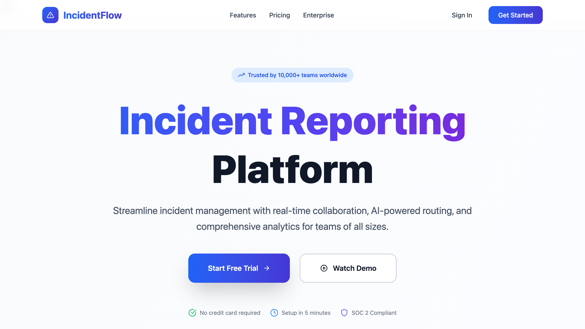

The welcoming landing page that introduces visitors to the Incident Report platform.

---

### 👥 Customer Portal

#### User Details & Profile
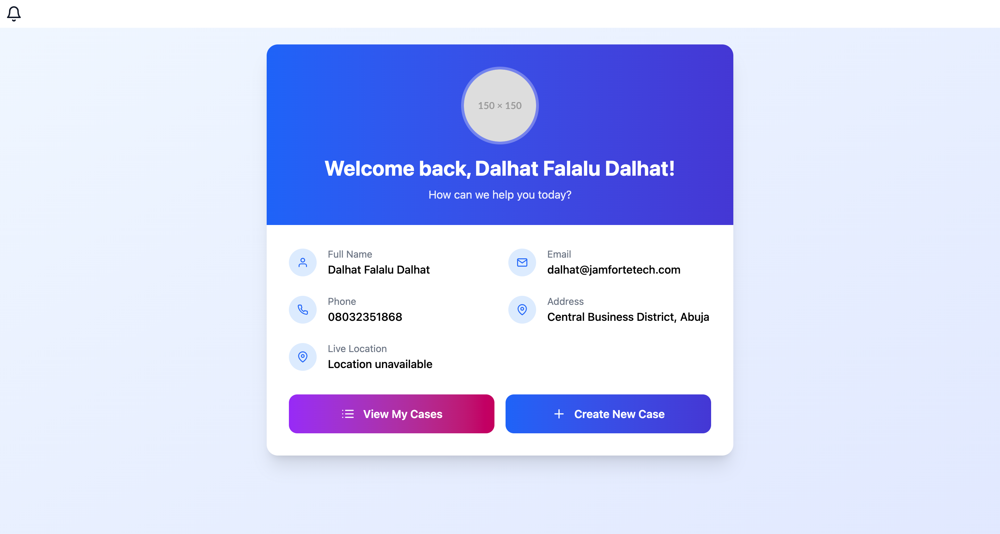
- User profile management
- Personal information updates

#### Department Selection
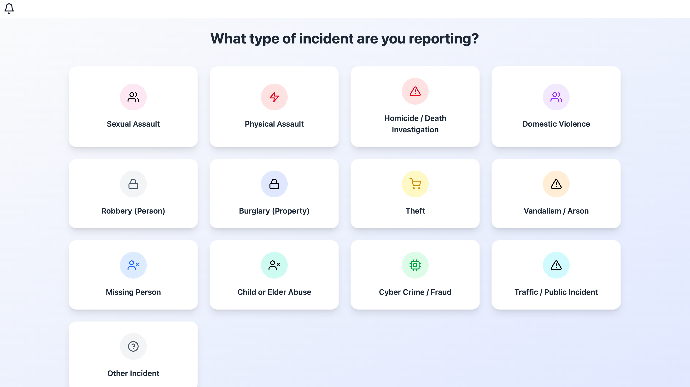
- Choose the appropriate department for your incident
- Multiple specialized departments available

#### My Cases
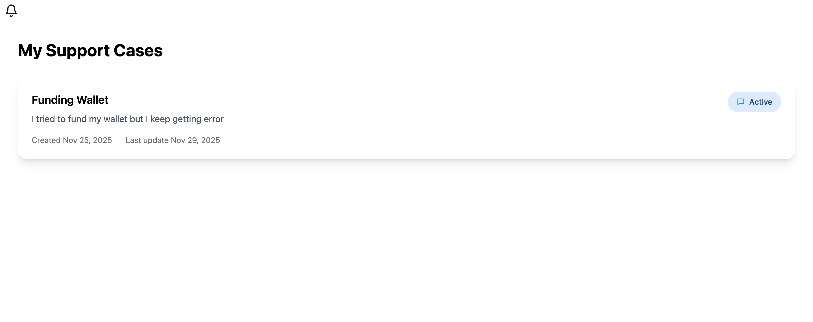
- View all your submitted cases
- Track case status and progress
- Monitor resolution timeline

#### My Cases (Mobile View)
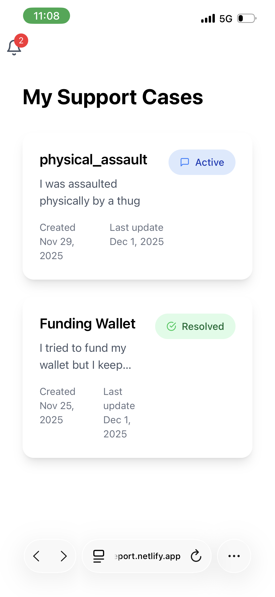
- Mobile-optimized case management interface
- Responsive design for on-the-go access
- Touch-friendly navigation

#### Real-Time Chat
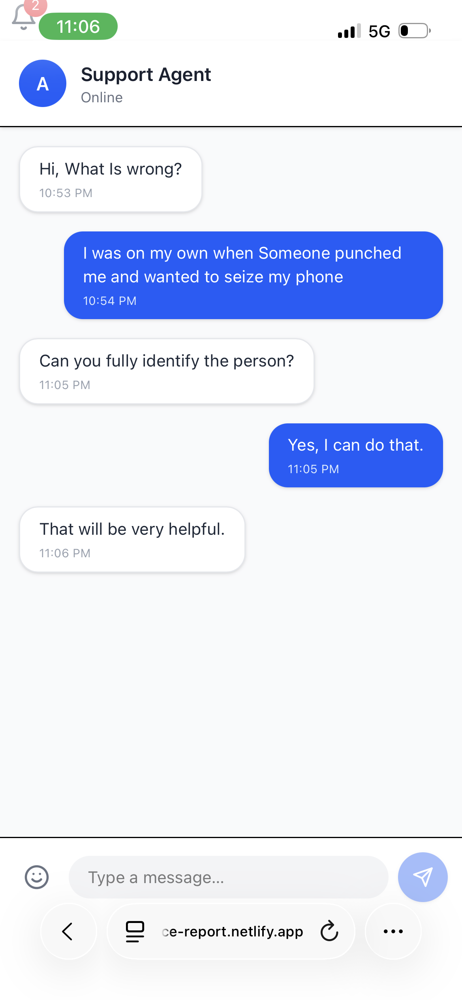
- Direct communication with assigned agents
- Real-time messaging via Socket.io
- File and image sharing support
- Mobile-optimized chat interface

---

### 👮 Agent Dashboard

#### Agent Dashboard Overview
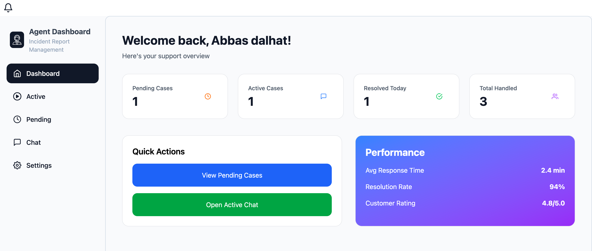
- Overview of assigned cases
- Quick access to pending, active, and resolved cases
- Performance metrics and statistics

#### Agent Cases Management
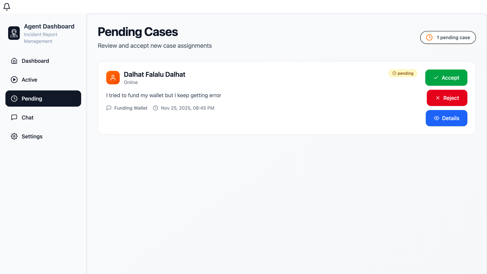
- Manage all assigned incidents
- Filter by status (pending, active, resolved)
- Quick case details and actions

#### Agent Chat
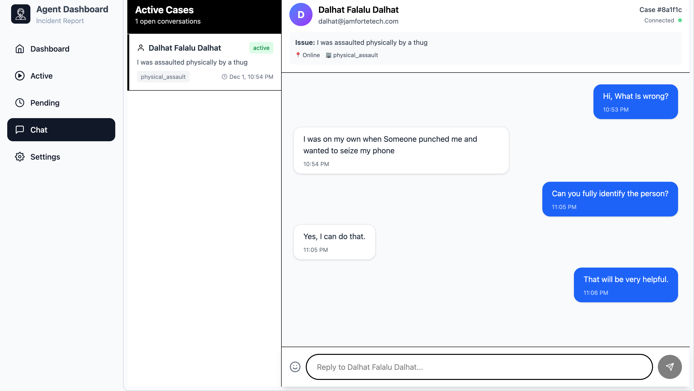
- Real-time communication with customers
- Multi-case chat management
- File sharing and media support
- Instant message delivery

#### Agent Settings
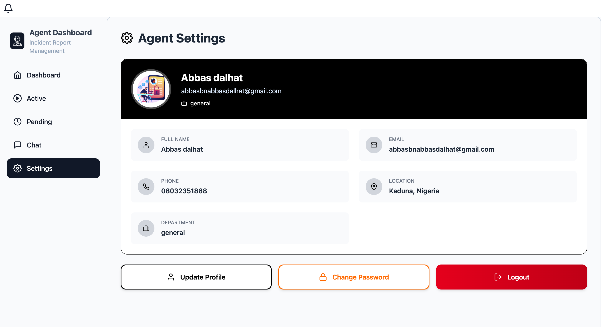
- Profile configuration
- Account settings and preferences

---

### 👔 Admin Panel

#### Admin Dashboard
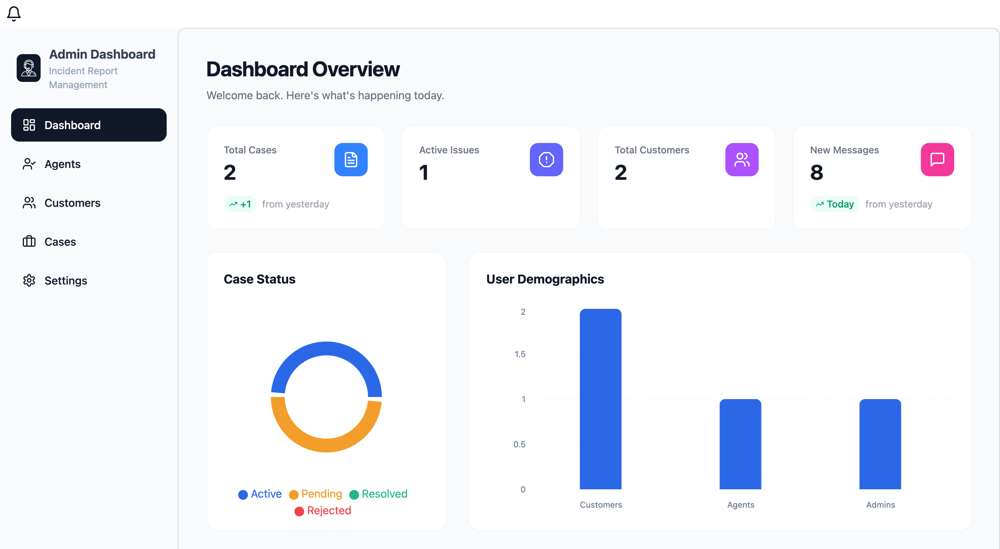
- Comprehensive analytics and statistics
- System-wide overview
- Key performance indicators

#### User Management
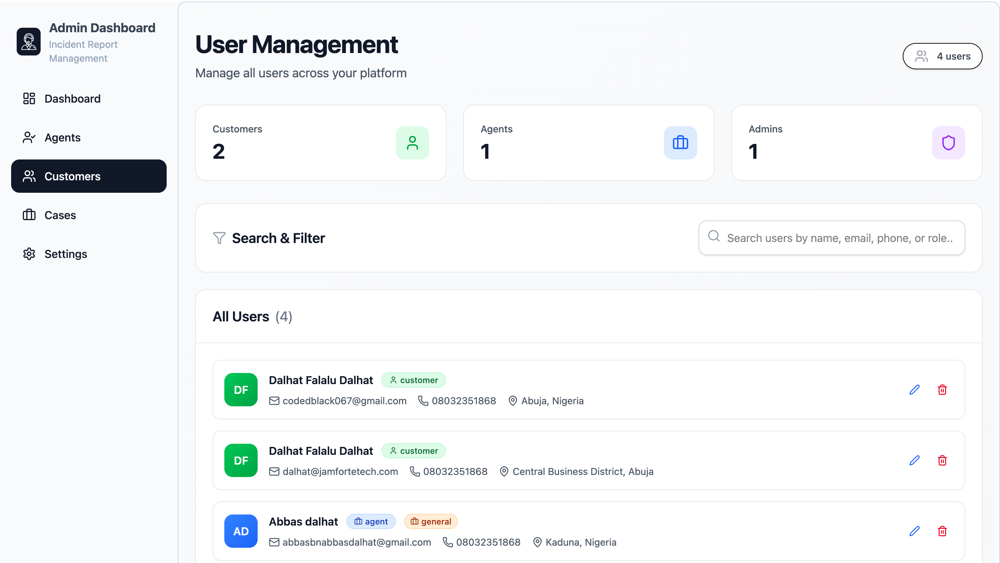
- Manage all users (customers, agents, supervisors)
- Create new agents and admins
- User role assignment and permissions

#### Case Management
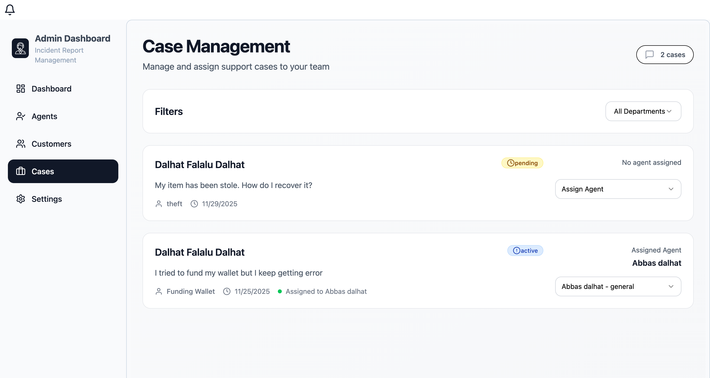
- View all cases across the system
- Assign cases to agents
- Monitor case resolution rates
- Department-wise case distribution

### 🗺️ Live User Tracking
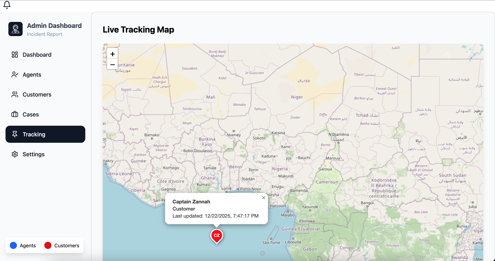
- Real-time user location visualization using Leaflet
- Accessible to agents and admins on the tracking page


---


## 🔧 Development

### Available Scripts

**Backend:**
```bash
npm start          # Start development server with nodemon
```

**Frontend:**
```bash
npm run dev        # Start Vite dev server
npm run build      # Build for production
npm run preview    # Preview production build
npm run lint       # Run ESLint
```

### Code Style

- **Frontend**: TypeScript with strict mode enabled
- **Backend**: ES6+ JavaScript
- **Linting**: ESLint with TypeScript support
- **Formatting**: Prettier (recommended)


---

## 🚢 Deployment

### Backend Deployment

1. **Environment Variables**: Set all required env vars in your hosting platform
2. **Database**: Use MongoDB Atlas for production
3. **Recommended Platforms**:
   - Render
   - Railway
   - Heroku
   - AWS EC2
   - DigitalOcean

### Frontend Deployment

1. **Build the project**:
   ```bash
   cd client
   npm run build
   ```

2. **Deploy the `dist` folder** to:
   - Vercel (recommended)
   - Netlify
   - AWS S3 + CloudFront
   - GitHub Pages

### Environment Variables for Production

Make sure to update:
- `ALLOWED_ORIGINS` with your production frontend URL
- `MONGODB_URI` with your production database
- `JWT_SECRET` with a strong, random secret
- `CLOUDINARY_*` with your production Cloudinary credentials

---

## 🤝 Contributing

Contributions are what make the open-source community such an amazing place to learn, inspire, and create. Any contributions you make are **greatly appreciated**!

1. Fork the repository
2. Create your feature branch (`git checkout -b feature/AmazingFeature`)
3. Commit your changes (`git commit -m 'Add some AmazingFeature'`)
4. Push to the branch (`git push origin feature/AmazingFeature`)
5. Open a Pull Request

### Contribution Guidelines

- Follow the existing code style
- Write meaningful commit messages
- Add tests for new features
- Update documentation as needed
- Ensure all tests pass

---

## 📝 License

This project is licensed under the **MIT License** - see the [LICENSE](LICENSE) file for details.

---

## 🙏 Acknowledgments

- [React](https://reactjs.org/) - The UI library
- [Express.js](https://expressjs.com/) - The web framework
- [Socket.io](https://socket.io/) - Real-time communication
- [MongoDB](https://www.mongodb.com/) - The database
- [Tailwind CSS](https://tailwindcss.com/) - The CSS framework
- [Radix UI](https://www.radix-ui.com/) - Accessible component primitives
- [Vite](https://vitejs.dev/) - The build tool

---

## 📧 Contact & Support

- **Issues**: [GitHub Issues](https://github.com/khalifadalhat/IncidentReport/issues)
- **Discussions**: [GitHub Discussions](https://github.com/khalifadalhat/IncidentReport/discussions)

---

## ⭐ Show Your Support

If you find this project helpful, please consider giving it a ⭐ on GitHub! It helps others discover the project and motivates continued development.

---

<div align="center">

**Built with ❤️ by Dalhat Dalhat falalu**

[⬆ Back to Top](#-incident-report---real-time-customer-support-platform)

</div>

